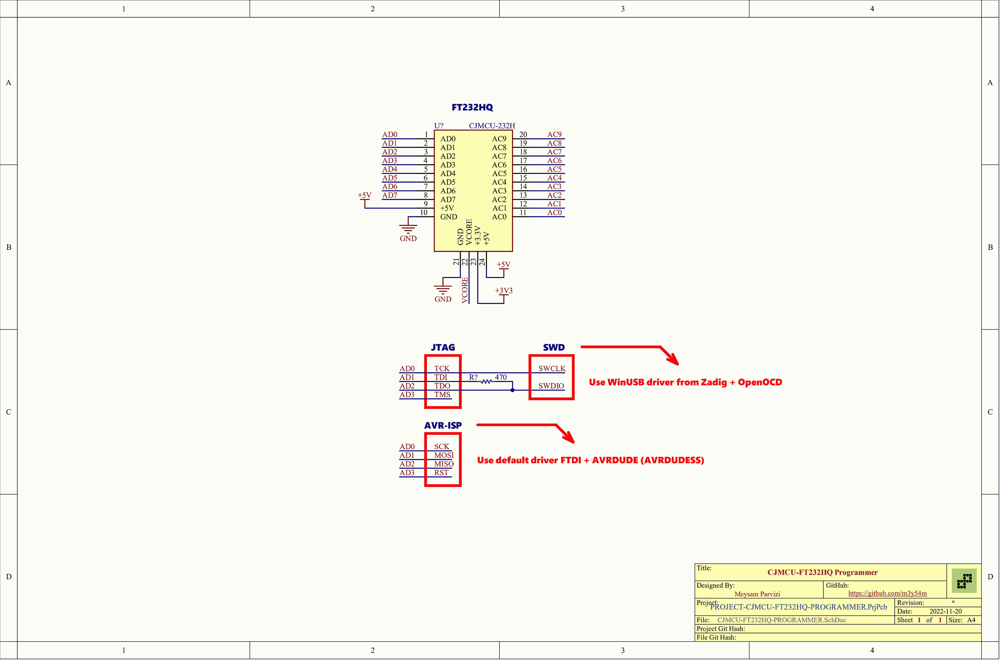

# CJMCU-232H-based JTAG, SWD, and AVR Programmer

This is a very popular module based on the FT232H chip made by CJMCU.
You can use this module as a high-speed programmer for your embedded projects.
I discovered that this module can be used as a JTAG and SWD programmer for ESP32 and STM32 microcontrollers.
It can also be used as an ISP programmer for AVR microcontrollers.

This module might be used to program other microcontrollers, but no information about them has been published yet. 

Any similar module/board based on FT233H/FT2232H which exposes `AD0`, `AD1`, `AD1`, and `AD3` pins can be used for this purpose.

**Note that voltage level of all I/Os is 3.3V**

### AVRDUDE

## Resources

- [Low-cost ESP32 In-circuit Debugging](https://medium.com/@manuel.bl/low-cost-esp32-in-circuit-debugging-dbbee39e508b)
- [Configuring JTAG debugging in Linux](https://nodemcu.readthedocs.io/en/dev-esp32/debug/)
- [How to use ft2232h adapter and openocd to debug the SWD interface of arm cortex M Series MCU](https://chowdera.com/2021/03/20210330082313911m.html)
- [AVRDUDE and FTDI *232H](http://www.jdunman.com/ww/AmateurRadio/SDR/helix_air_net_au%20%20AVRDUDE%20and%20FTDI%20232H.htm)
- [TinyAVR-0/1 Programming](https://semjonov.de/docs/tips/avr/)
